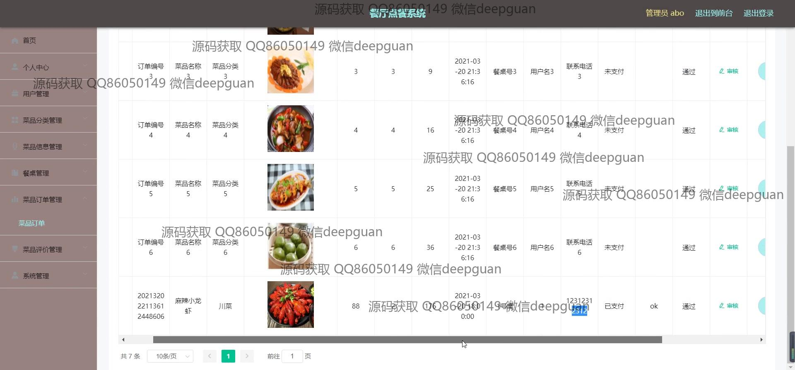

<h1 align="center">餐厅点餐系统</h1>

## 简介
餐厅点餐系统：角色分为管理员和用户；功能包括用户管理、菜品分类管理、菜品信息管理、桌台管理、菜品订单管理、评价管理和系统管理，以及用户注册、登录与支付功能。    --计算机毕业设计源码；毕设源码；java毕业设计源码

## 联系方式

<h3 align="center">获取完整代码与数据库文件 + 微信：deepguan QQ: 86050149 QQ群: 783742310</h3>

<h3 align="center">可帮忙远程部署 包运行成功！提供远程部署、修改代码、设计文档指导、代码讲解等服务！</h3>

## 功能介绍（完整见运行截图）
管理员： 管理员可以通过后台管理界面进行登录注册及退出操作。系统提供了个人中心、用户管理、菜品分类和信息管理、餐桌和订单管理、以及评价管理等功能模块，管理员可以利用这些功能查看用户和订单详情，添加或编辑菜品及分类，管理餐桌信息，并处理用户评价。此外，管理员还可以通过系统管理模块配置轮播图，查看统计报表以了解菜品评价分布，增强餐厅信息化管理效率。

用户： 用户可以在系统中进行注册与登录，访问首页、菜品信息、菜品资讯、个人中心以及后台管理等模块。在个人中心，用户可以修改个人信息，查看订单和收藏夹。通过菜品信息模块，用户能够浏览系统中展示的不同菜品，使用分类筛选或直接搜索特定菜品。在线点餐时，用户可以查看菜品详情，包括图片和价格，选择下单数量并确认订单，通过集成的在线支付功能进行付款。

## 运行截图

本代码来源于网络,仅供学习参考使用!

